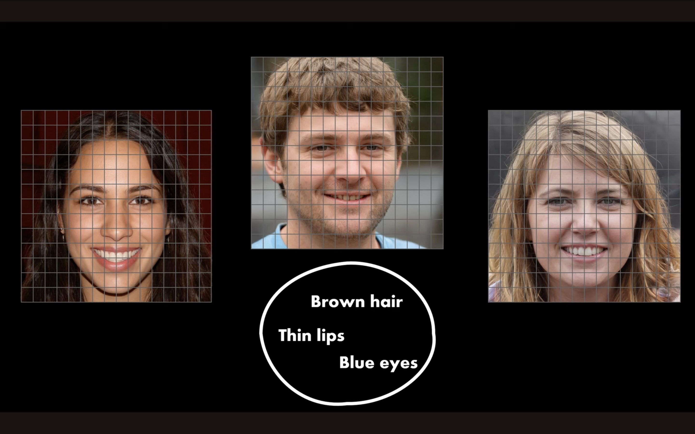

```{r setup, include=FALSE}
knitr::opts_chunk$set(echo = TRUE)
```

# **Why Dimensionality Reduction?**

Dimensionality reduction is a foundational technique in data science, bioinformatics, and biological anthropology that transforms complex, high-dimensional datasets into simpler, lower-dimensional representations—**without losing the core structure or meaning of the data**. This is achieved by creating new variables (dimensions) that capture the most important variation from the original features.

{width="700"}

It is not only a mathematical tool but also a **practical necessity** when working with multivariate data such as:

-   Skeletal measurements

-   Facial landmark coordinates

-   Gene expression profiles

-   High-resolution image or sensor data

Below is a detailed rationale for **why and when dimensionality reduction is used**:

1.  Cognitive and Interpretive Simplicity
    -   Human perception is limited—we can only visualize and intuitively interpret up to 3 dimensions. Dimensionality reduction techniques like PCA, t-SNE, and UMAP allow complex, multidimensional patterns to be projected into 2D or 3D, enabling clearer pattern recognition, cluster detection, and insightful storytelling.
2.  Computational Efficiency
    -   High-dimensional data is expensive to store, process, and analyze. Algorithms slow down and can become unstable in large feature spaces due to what's known as the **curse of dimensionality**. Reducing dimensions leads to:

        -   Faster computation

        -   Less memory usage

        -   Smoother model convergence

        This is especially important in real-time systems or large-scale analyses (e.g., clustering thousands of skeletal scans).
3.  Noise and Redundancy Reduction
    -   Many datasets contain **irrelevant, noisy, or correlated features**. Dimensionality reduction removes redundancy and compresses features into a set of **uncorrelated principal components** or **embedding coordinates**.

    -   This boosts the **signal-to-noise ratio**, improves model performance, and reduces overfitting by focusing on what truly matters.
4.  Better Model Performance and Generalization
    -   By discarding irrelevant or misleading variables, dimensionality reduction helps machine learning models:

        -   Generalize better to new data

        -   Avoid overfitting

        -   Perform well with fewer features

        Derived features—like PC1 and PC2—can also be used as inputs for supervised learning or clustering
5.  Visualization and Communication
    -   Visualization is a cornerstone of exploratory data analysis. Dimensionality reduction allows for the **plotting of complex data** in 2D or 3D to:

        -   Detect clusters or groupings

        -   Find outliers or rare variants

        -   Communicate patterns effectively in presentations or publications

        For example, t-SNE can reveal subgroupings in chimpanzee vocalization patterns, or UMAP can show clusters of gene expression in skeletal tissue types.

# **Principal Component Analysis (PCA)**

## Introduction

The main purpose of the project is to present and implement unsupervised learning methods for **Principal Component Analysis (PCA)** - a statistical method to reduce dimensionality. PCA is used to extract significant information from a multivariate data table and to express this information as a set of few new variables called principal components. The goal of PCA is to identify directions that can be visualized graphically with minimal loss of information.


## Why PCA?

### **What it does well:**

-   Captures the most variance with the fewest components

-   Reveals **global structure** in your data

-   Creates **interpretable axes** (often size, shape, etc.)

-   Quick and easy to run

### **What it doesn't do:**

-   Doesn’t preserve **local relationships** (nearby points in high-D space may not stay close)

-   Can miss **nonlinear structure** (like clusters in curved shapes)

{width="681"}

### The following assumptions are made by the principal component analysis:

-   There is a linear combination between variables.

-   It assumes that the principal components having the highest variance are more important than those which don't, and consider them to include noise in the data.

-   More outliers in the data include experimental errors.

The data set from the PCA gives a great representation of the original data.

## How it works

{width="735"}

[Source](https://www.datacamp.com/tutorial/pca-analysis-r)

### Step 1 - Data normalization

Information has different scales and performing PCA using such data will lead to a biased result. This is where data normalization comes in. It ensures that each attribute has the same level of contribution, preventing one variable from dominating others. For each variable, normalization is done by subtracting its mean and dividing by its standard deviation.

### Step 2 - Covariance matrix

As the same suggests, this step is about computing the **covariance matrix** from the normalized data. This is a symmetric matrix, and each element (i, j) corresponds to the covariance between variables i and j.

### Step 3 - Eigenvectors and eigenvalues

Geometrically, an **eigenvector** represents a direction such as “vertical” or “90 degrees”. An **eigenvalue**, on the other hand, is a number representing the amount of variance present in the data for a given direction. Each  eigenvector has its corresponding eigenvalue. 

### Step 4 - Selection of principal components

There are as many pairs of eigenvectors and eigenvalues as the number of variables in the data. In the data with only monthly expenses, age, and rate, there will be three pairs. Not all the pairs are relevant. So, the eigenvector with the highest eigenvalue corresponds to the first principal component. The second principal component is the eigenvector with the second highest eigenvalue, and so on.

### Step 5 - Data transformation in new dimensional space

This step involves re-orienting the original data onto a new subspace defined by the principal components This reorientation is done by multiplying the original data by the previously computed eigenvectors.

It is important to remember that this transformation does not modify the original data itself but instead provides a new perspective to better represent the data. 

## **Real-World Example of PCA in R**

### 1. Set Up

```{r}
library("ggplot2")
library("ggfortify")
library("gridExtra")
library("carData")
library("car")
library("factoextra")
library("corrplot")
```

### 2. Explore Data

Now it is possible to load demo dataset *decathlon2* from the *factoextra* package. The data describes athletes’ performance during two sporting events (Desctar and OlympicG). It contains 27 individuals (athletes) described by 13 variables (sport disciplines). For further analysis, I will subset active individuals (rows 1:23) and active variables (columns 1:10) from *decathlon2* dataset, therefore I will create new dataset *decathlon2.active* to conduct the principal component analysis. *Decathlon2.active* dataset consists of 23 observations and 10 variables (presented below).

```{r}
data(decathlon2)
decathlon2.active <- decathlon2[1:23, 1:10]
head(decathlon2.active)
```

In order to provide the model, a summary of data is required. The variables (sport disciplines) descriptions are as follows: X100m - 100 metres results expressed in seconds Long.jump - long jump results expressed in metres Shot.put - shot put results expressed in metres High.jump - high jump results expressed in metres X400m - 400 metres results expressed in seconds X110m.hurdle - 110 metres hurdle race results expressed in seconds Discus - discus throw results expressed in metres Pole.vault - pole vault results expressed in metres Javeline - javeline throw results expressed in metres X1500m - 1500 metres results expressed in seconds

The summary statistics and histograms below show the distribution of observations in all numeric variables. Horizontal axis represents the values of observations, while the vertical axis “count” shows the amount of certain observations for each value.

```{r}
summary(decathlon2.active)
```

### 3. Normalize data and covariance matrix

The first step of the analysis is focused around computation of PCA using prcomp() function. This command allows for: centering data around 0 by shifting the variables; rescaling the variance to 1 unit; data standarization needed due to the fact that variables are measured in different scales. Additionally, the eigenvalues are extracted by get_eigenvalue() function. Eigenvalues measure the amount of variation held by each principal component (PC). They are evaluated to determine the number of principal components to be considered.

```{r}
res.pca <- prcomp(decathlon2.active, scale = TRUE)
print(res.pca)
```

```{r}
summary(res.pca)

```

### 4. Eigenvectors and eigenvalues

```{r}
eig.val<-get_eigenvalue(res.pca)
eig.val
```

```{r}
fviz_eig(res.pca, col.var="blue")

```

On the basis of importance of components, is it visible that first two PCs have the highest vales for proportion of variance. This statement is also proved by eigenvalues measure. They are large for the first PCs and small for the subsequent PCs, which means that the first PCs corresponds to the directions with the maximum amount of variation in the data set. The sum of all the eigenvalues gives a total variance of 10. As far as scatter plot is concerned, first eigenvalue explain 41.24% of the variation, second - 18.385%. Therefore, 59.627% of the variation is explained by the first two eigenvalues together, which is a proper indicator for further analysis.

### 5. Selection of principal components

PCA results can be assesed with regard to variables (sport disciplines) and individuals (athletes). Firstly, I will conduct extraction of results for variables. For that purpose get_pca_var() is used to provide a list of matrices containing all the results for the active variables (coordinates, correlation between variables and axes, squared cosine, and contributions).

```{r}
#PCA results for variables
var <- get_pca_var(res.pca)
var
```

**Cos2** is called square cosine (squared coordinates) and corresponds to the quality of representation of variables. Cos2 of variables on all the dimensions using the *corrplot* package is displayed below, as well as bar plot of variables cos2 using the function fviz_cos2().

```{r}
head(var$cos2)
```

### 6. Data transformation in new dimensional space

```{r}
library("corrplot")
corrplot(var$cos2, is.corr=FALSE)
```

```{r}
fviz_cos2(res.pca, choice = "var", axes = 1:2)

```

Additionally, the quality of representation of variables can be draw on the factor map, where cos2 values differ by gradient colors. Variables with low cos2 values will be colored “darkorchid4”, medium cos2 values - “gold”, high co2 values - “darkorange”. Positively correlated variables are grouped together, whereas negatively correlated variables are positioned on opposite sides of the plot origin. The distance between variables and the origin measures the quality of the variables on the factor map. Variables that are away from the origin are well represented on the factor map.

```{r}
fviz_pca_var(res.pca,
             col.var = "cos2", # Color by the quality of representation
             gradient.cols = c("darkorchid4", "gold", "darkorange"),
             repel = TRUE
             )
```

X100m, Long.jump and Pole.vault have very high cos2, which implies a good representation of the variable on the principal component. In this case variables are positioned close to the circumference of the correlation circle. Javeline has the lowest cos2, which indicates that the variable is not perfectly represented by the PCs. In this case the variable is close to the center of the circle - it is less important for the first components.

**Contrib** is a contribution of variables. The function fviz_contrib() is used to draw a bar plot of variable contributions for the most significant dimensions, therefore PC1 and PC2.

```{r}
# Contributions of variables to PC1
a<-fviz_contrib(res.pca, choice = "var", axes = 1)
# Contributions of variables to PC2
b<-fviz_contrib(res.pca, choice = "var", axes = 2)
grid.arrange(a,b, ncol=2, top='Contribution of the variables to the first two PCs')
```

The red dashed line on the graph above indicates the expected average contribution. For a certain component, a variable with a contribution exceeding this benchmark is considered as important in contributing to the component. It can be seen that the variables X100m, Long.jump and Pole.vault contribute the most to both dimensions.

#### **PCA results for individuals**

The results, for individuals (athletes) will be extracted using the function get_pca_ind(). Similarly to variables, it provides a list of matrices containing all the results for the individuals (coordinates, correlation between individuals and axes, squared cosine, and contributions). As for the individuals, the analysis will be focused on **cos2** and **contributions of individuals** to the first two principal components (PC1 and PC2).

```{r}
ind <- get_pca_ind(res.pca)
ind

```

```{r}
fviz_pca_ind(res.pca,
             col.ind = "cos2", # Color by the quality of representation
             gradient.cols = c("darkorchid4", "gold", "darkorange"),
             repel = TRUE
             )
```

```{r}
# Total contribution on PC1 and PC2
fviz_contrib(res.pca, choice = "ind", axes = 1:2)
```

Based on the position of the red dashed line (average contribution), individuals BOURGUIGNON, Karpov and Clay contribute the most to both dimensions.

The summary of above PCA analysis for both variables (sport disciplines) and individuals (athletes) is displayed in a correlation plot (autoplot) from *ggfortify* package wirg reference to dimensions 1 and 2.

```{r}
autoplot(res.pca, loadings=TRUE, loadings.colour='darkorchid4', loadings.label=TRUE, loadings.label.size=3)

```

### **Final results and analysis**

The purpose of this project is to distinguish which athletes obtained the best results among the whole group. So far, the Principal Component Analysis was conducted for both variables (sport disciplines) and individuals (athletes) with the use of prcomp() computation, eigenvalues extraction, square cosine and contributions. Considering the calculated PCs, I will summarize them in clusters via k-means clustering method. For that purpose, I will use eclust() function with 4 clusters as an assumption and autoplot() for 2D observations.

```{r}
kmeans<-eclust(decathlon2.active, k=4)

```

```{r}
autoplot(res.pca, data=kmeans, colour="cluster")

```

Cluster which is the closest to the origin (blue) presents athletes with the best results in sport disciplines. Violet cluster shows the athletes with average results, wheres remaining clusters (green and red) correspond to the worst athletes.

# Summary

|                     |                          |
|---------------------|--------------------------|
| **Feature**         | **PCA**                  |
| Type                | Linear                   |
| Preserves           | Global structure         |
| Axis Interpretation | Easy (e.g., size, shape) |
| Clustering          | Limited                  |
| Speed               | Fast                     |
| Use Case            | Morphometrics, trends    |
