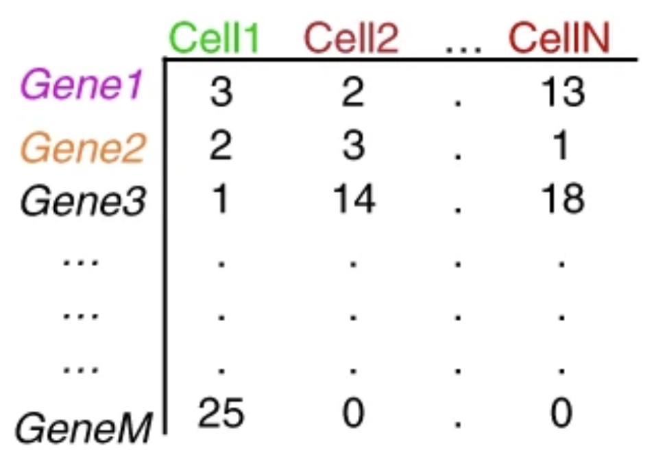

# Overview Of UMAP

UMAP (Uniform Manifold Approximation and Projection) is a nonlinear dimension reduction technique that finds meaningful structure in high-dimensional data by combining ideas from manifold learning and topology.  


[Great YouTube Video for more background on dimension reduction](https://www.youtube.com/watch?v=jc1_yPYmspk&list=PLV8yxwGOxvvoJ87mFL27k7XSDq_lF3pD5&index=1)


The basic principles are: after projecting these high dimensional data to the manifold, UMAP use the simplices complex to connect them and we can use the the weight of the edges to calculate how connected each of them are. At the end we use a low dimensional graph (2D or 3D) that preserves the high dimensional information.


## More specifically...


   
1. **Capturing Local Relationships:**  
   UMAP begins by analyzing each data point to identify its nearest neighbors in the high-dimensional space. This process builds a neighborhood graph that represents the local structure. Essentially, it captures who is close to whom.

2. **Creating a Fuzzy Topological Representation:**  
    UMAP assigns a probability (from 0 to 1) to each connection. This creates what’s known as a fuzzy simplicial set that captures both the local and some global structures of the data. The Fuzzy graph is like a representation of the weighted graph and each wedge has a "weight" that represents how likely the two points are connected.

 
3. **Optimizing the Low-dimensional Embedding:**  
   UMAP then try to find a lower-dimensional space where these fuzzy relationships are best preserved. An optimization algorithm minimizes the difference between the high-dimensional fuzzy relationships and the layout in the low-dimensional space.
   
## Key Parameters in UMAP

UMAP provides several parameters that help balance the preservation of local versus global structures:

- **n_neighbors:**  
  - This parameter defines the number of nearest neighbors considered for each point when constructing the high-dimensional graph.
  - **Low values** focus the method on local structure (resulting in tighter, more isolated clusters).
  - **High values** allow the method to incorporate more global structure at the expense of local details.

- **min_dist:**  
  - This parameter controls how close points are allowed to get in the low-dimensional display.
  - **Smaller values** lead to tighter clustering, which can highlight fine local structure.
  - **Larger values** spread out the points, preserving broader topological relationships between clusters.

By adjusting these parameters, UMAP can be fine-tuned for different types of data and different visualization needs.


5. **UMAP vs. t-SNE:**  
   Both UMAP and t-SNE are designed to preserve local structure:
   
   - **t-SNE:** Focuses strongly on local relationships and can produce very clear clusters, but sometimes struggles with representing the global structure and requires more computational effort for large data sets.
   - **UMAP:** Often preserves both local and global structures better, scales well to larger data sets, and tends to run faster than t-SNE.

These principles make UMAP a powerful tool not only for image data but also for other types of high-dimensional data.

---

*Sources for further reading:*

- McInnes, L., Healy, J., & Melville, J. (2018). [UMAP: Uniform Manifold Approximation and Projection for Dimension Reduction](https://arxiv.org/abs/1802.03426).  
- The [UMAP documentation](https://umap-learn.readthedocs.io/en/latest/) provides detailed examples and additional resources.
- The [Fuzzy complex](https://pair-code.github.io/understanding-umap/).

# Background and Introduction of our challenges

Recognizing handwritten digits was one of the first victories for computer vision. Back in the 1990s, researchers cracked the problem by training models to read messy, human‑scribbled numbers. Those early successes powered automated mail‑sorting machines which leads to faster and more efficient mail distribution.

We will use the MNIST data set from [a Kaggle competition](https://www.kaggle.com/competitions/digit-recognizer/overview), which consists of 28×28 pixel images of handwritten digits. Each image is represented by 784 dimensions (one for each pixel). In each dimension, there is a gray scale values which are integer from 0 (black) to 255 (white). Our goal is to reduce this high-dimensional data to a lower-dimensional space using UMAP. By doing so, we aim to:

- **Simplify the feature space:** Reduce from 784 columns down to 2 or 3 dimensions.
- **Visualize underlying structure:** See how digits cluster together based on their inherent similarities.
- **Preserve the ability to distinguish digits:** Ensure that even after dimensional reduction, the clusters remain well separated, allowing us to identify each digit.


### Loading packages

```{r, message=FALSE, warning=FALSE}
# Load libraries
library(uwot)
library(ggplot2)
library(plotly)
library(viridis)
```

### Getting the MNIST data

```{r}
# Get access to the MINIST
all_data <- read.csv("https://raw.githubusercontent.com/Yuanruo-Sherry-Xie/Group_Presentation_and_R_Vignette/refs/heads/main/MNIST.csv")
```

### Data Preprocessing

```{r}
# Because the data is enormous, let's randomly sample 10,000 rows
set.seed(123)  # For reproducibility
sample_size <- 10000
idx <- sample(nrow(all_data), sample_size)
subset_data <- all_data[idx, ]
head(subset_data[, 1:10])
```

Now, we separate the label (first column) from the pixel data and normalize the pixel values to a 0-1 scale.
```{r}
# The first column is the label
labels <- subset_data[, 1]

# The remaining columns are the 784 pixel values
pixel_data <- subset_data[, -1]

# Normalize the data
pixel_data <- pixel_data / 255
```

## Challenge 1: Running UMAP

The next step is to reduce the dimensions of the pixel data from 784 dimensions to 2 dimensions using UMAP. This makes it easier to visualize the data and observe how the digits cluster.
```{r,message=FALSE}
umap_result <- umap(
  pixel_data, 
  n_neighbors = 15,    # typical value. Try adjusting this parameter :)
  n_components = 2,    # for making a 2D graph
  min_dist = 0.1,      # adjust for tighter or looser clustering display
  verbose = TRUE       # to see progress messages
)
```

## Challenge 2: Visualizing UMAP Results

Next, we merge the UMAP results with the digit labels into a data frame called plot_data. We then use ggplot2 to create a scatter plot that shows how the digits cluster in the 2D embedding.
```{r}
# Combine the UMAP results with labels into a data frame
plot_data <- data.frame(
  UMAP_1 = umap_result[, 1],
  UMAP_2 = umap_result[, 2],
  label  = as.factor(labels)
)
```

```{r}
ggplot(plot_data, aes(x = UMAP_1, y = UMAP_2, color = label)) +
  geom_point(alpha = 0.6) +
  scale_color_viridis_d(option = "viridis") +
  labs(title = "UMAP of MNIST Data",
       x = "UMAP-1",
       y = "UMAP-2",
       color = "Digit") +
  theme_minimal()
```

## Challenge 3: Tuning n_neighbors and min_dist

Once you have generated your first UMAP plot, it is useful to experiment with different parameters to see their effect on the clustering. Below are some exercises that modify key UMAP parameters.

### Example 1: Lower n_neighbors and Smaller min_dist

This experiment emphasizes local structure in the data. Lower n_neighbors and min_dist can result in tighter clusters.
```{r}
umap_local <- umap(pixel_data, n_neighbors = 5, n_components = 2, min_dist = 0.01)
plot_data_local <- data.frame(
  UMAP_1 = umap_local[, 1],
  UMAP_2 = umap_local[, 2],
  label  = as.factor(labels)
)
ggplot(plot_data_local, aes(x = UMAP_1, y = UMAP_2, color = label)) +
  geom_point(alpha = 0.6) +
  scale_color_viridis_d(option = "viridis") +
  labs(title = "UMAP with n_neighbors = 5, min_dist = 0.01") +
  theme_minimal()
```

### Example 2: Higher n_neighbors and Larger min_dist

```{r}
umap_global <- umap(pixel_data, n_neighbors = 50, n_components = 2, min_dist = 0.5)
plot_data_global <- data.frame(
  UMAP_1 = umap_global[, 1],
  UMAP_2 = umap_global[, 2],
  label  = as.factor(labels)
)
ggplot(plot_data_global, aes(x = UMAP_1, y = UMAP_2, color = label)) +
  geom_point(alpha = 0.6) +
  scale_color_viridis_d(option = "viridis") +
  labs(title = "UMAP with n_neighbors = 50, min_dist = 0.5") +
  theme_minimal()
```

## Challenge 4: Extending UMAP to 3D

If we are feeling advanced we can also change the n_components to 3 so we plot our UMAP in 3D.
```{r}
# Perform UMAP with 3 components for 3D embedding
umap_3d <- umap(pixel_data, n_neighbors = 50, n_components = 3, min_dist = 0.5)
plot_data_3d <- data.frame(
  UMAP_1 = umap_3d[, 1],
  UMAP_2 = umap_3d[, 2],
  UMAP_3 = umap_3d[, 3],
  label  = as.factor(labels)
)

# Using the plotly package to plot the 3D data
plot_ly(data = plot_data_3d, 
        x = ~UMAP_1, 
        y = ~UMAP_2, 
        z = ~UMAP_3, 
        color = ~label, 
        colors = "Set3", 
        type = "scatter3d", 
        mode = "markers",
        marker = list(size = 2)) %>% 
  layout(title = "Interactive 3D UMAP Plot")
```

# Conclusion and Broader Applications

Now, we learned how to apply UMAP to reduce a high-dimensional MNIST dataset into a lower-dimensional space, making it easier to visualize and understand how the data clusters

UMAP is not only a powerful tool for image data. Tt is also extremely important in biology research. For instance, in single-cell RNA sequencing (scRNA-seq), researchers work with cell count matrices where each cell's gene expression profile is represented by thousands of features (genes). These matrices are very high-dimensional, much like our MNIST dataset.

  

By applying UMAP to single-cell RNA sequencing data, biologists can reduce the dimensionality of the data to 2 or 3 dimensions. This allows them to visualize and identify clusters of cells that correspond to different cell types. In effect, UMAP helps to annotate and classify cells based on their gene expression patterns, enabling a deeper understanding of cellular diversity and function.

  
- The [Source](https://datascienceforbio.com/scanpy-umap-dotplot-and-heatmap/)

Ultimately, whether you’re working with images or gene expression data, UMAP provides a versatile and powerful means to condense high-dimensional large data sets into meaningful visuals in a time-efficient manner.