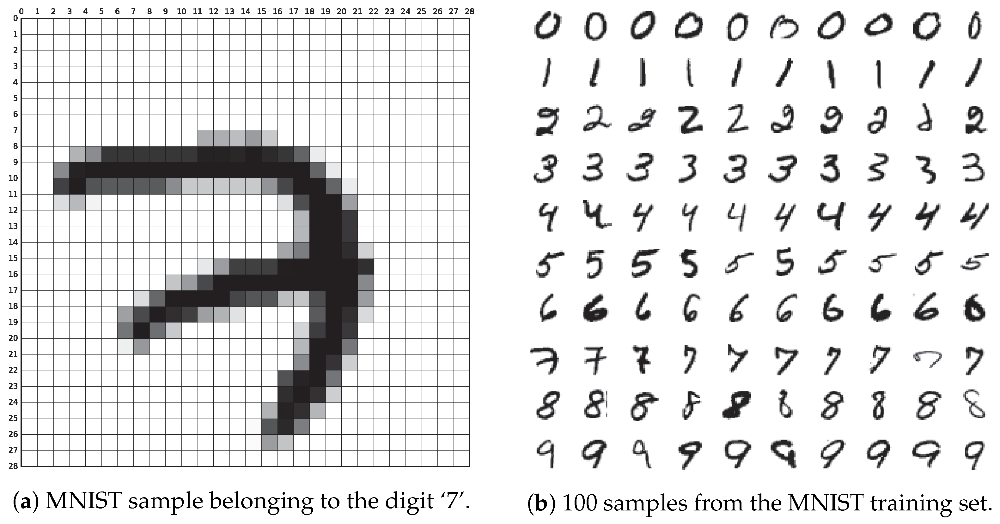

```{r setup, include=FALSE}
knitr::opts_chunk$set(cache = TRUE)
```

# Introduction

Dimensionality reduction is a foundational technique in data science, bioinformatics, and biological anthropology that transforms complex, high-dimensional datasets into simpler, lower-dimensional representations—**without losing the core structure or meaning of the data**. This is achieved by creating new variables (dimensions) that capture the most important variation from the original features.

## Real Example

)](figure_1.png){width="700"}

<br> Imagine every pixel in a photo is a separate question a computer must answer: *"How bright is the dot at row 37, column 212?"* A small, 64 × 64 gray‑scale picture already has 4,096 such questions (64 × 64 = 4,096). Each question is one dimension in the data.

So, when a computer tries to tell two faces apart, it is really comparing **thousands of dimensions at once**—far more than we humans ever think about.

## Motivations

It is not only a mathematical tool but also a **practical necessity** when working with multivariate data such as:

-   Skeletal measurements

-   Facial landmark coordinates

-   Gene expression profiles

-   High-resolution image or sensor data

Below is a detailed rationale for **why and when dimensionality reduction is used**:

1.  Cognitive and Interpretive Simplicity
    -   Human perception is limited—we can only visualize and intuitively interpret up to 3 dimensions. Dimensionality reduction techniques like PCA, t-SNE, and UMAP allow complex, multidimensional patterns to be projected into 2D or 3D, enabling clearer pattern recognition, cluster detection, and insightful storytelling.
2.  Computational Efficiency
    -   High-dimensional data is expensive to store, process, and analyze. Algorithms slow down and can become unstable in large feature spaces due to what's known as the **curse of dimensionality**. Reducing dimensions leads to:

        -   Faster computation

        -   Less memory usage

        -   Smoother model convergence

        This is especially important in real-time systems or large-scale analyses (e.g., clustering thousands of skeletal scans).
3.  Noise and Redundancy Reduction
    -   Many datasets contain **irrelevant, noisy, or correlated features**. Dimensionality reduction removes redundancy and compresses features into a set of **uncorrelated principal components** or **embedding coordinates**.

    -   This boosts the **signal-to-noise ratio**, improves model performance, and reduces overfitting by focusing on what truly matters.
4.  Better Model Performance and Generalization
    -   By discarding irrelevant or misleading variables, dimensionality reduction helps machine learning models:

        -   Generalize better to new data

        -   Avoid overfitting

        -   Perform well with fewer features

        Derived features—like PC1 and PC2—can also be used as inputs for supervised learning or clustering
5.  Visualization and Communication
    -   Visualization is a cornerstone of exploratory data analysis. Dimensionality reduction allows for the **plotting of complex data** in 2D or 3D to:

        -   Detect clusters or groupings

        -   Find outliers or rare variants

        -   Communicate patterns effectively in presentations or publications

        For example, t-SNE can reveal subgroupings in chimpanzee vocalization patterns, or UMAP can show clusters of gene expression in skeletal tissue types.

# PCA

## Overview

The main purpose of the project is to present and implement unsupervised learning methods for **Principal Component Analysis (PCA)** - a statistical method to reduce dimensionality. PCA is used to extract significant information from a multivariate data table and to express this information as a set of few new variables called principal components. The goal of PCA is to identify directions that can be visualized graphically with minimal loss of information.

)**](figure_2.png){width="700"}

## Why PCA?

**What it does well:**

-   Captures the most variance with the fewest components

-   Reveals **global structure** in your data

-   Creates **interpretable axes** (often size, shape, etc.)

-   Quick and easy to run

**What it doesn't do:**

-   Doesn’t preserve **local relationships** (nearby points in high-D space may not stay close)

-   Can miss **nonlinear structure** (like clusters in curved shapes)

)**](figure_3.png){width="700"}

<br> **The following assumptions are made by the principal component analysis:**

-   There is a linear combination between variables.

-   It assumes that the principal components having the highest variance are more important than those which don't, and consider them to include noise in the data.

-   More outliers in the data include experimental errors.

-   The data set from the PCA gives a great representation of the original data.

## How it works

)](https://media.datacamp.com/legacy/image/upload/v1676290161/5_main_steps_for_computing_principal_components_7aa5efa2ad.png){width="700"}

### Step 1 - Data normalization

Information has different scales and performing PCA using such data will lead to a biased result. This is where data normalization comes in. It ensures that each attribute has the same level of contribution, preventing one variable from dominating others. For each variable, normalization is done by subtracting its mean and dividing by its standard deviation.

### Step 2 - Covariance matrix

As the same suggests, this step is about computing the **covariance matrix** from the normalized data. This is a symmetric matrix, and each element (i, j) corresponds to the covariance between variables i and j.

### Step 3 - Eigenvectors and eigenvalues

Geometrically, an **eigenvector** represents a direction such as “vertical” or “90 degrees”. An **eigenvalue**, on the other hand, is a number representing the amount of variance present in the data for a given direction. Each eigenvector has its corresponding eigenvalue.

### Step 4 - Selection of principal components

There are as many pairs of eigenvectors and eigenvalues as the number of variables in the data. In the data with only monthly expenses, age, and rate, there will be three pairs. Not all the pairs are relevant. So, the eigenvector with the highest eigenvalue corresponds to the first principal component. The second principal component is the eigenvector with the second highest eigenvalue, and so on.

### Step 5 - Data transformation in new dimensional space

This step involves re-orienting the original data onto a new subspace defined by the principal components This reorientation is done by multiplying the original data by the previously computed eigenvectors.

It is important to remember that this transformation does not modify the original data itself but instead provides a new perspective to better represent the data.

## Real-World Example of PCA in R

### 1. Set Up

```{r, message=FALSE}
library("ggplot2")
library("ggfortify")
library("gridExtra")
library("carData")
library("car")
library("factoextra")
library("corrplot")
```

### 2. Explore Data

Now it is possible to load demo dataset *decathlon2* from the *factoextra* package. The data describes athletes’ performance during two sporting events (Desctar and OlympicG). It contains 27 individuals (athletes) described by 13 variables (sport disciplines). For further analysis, we will subset active individuals (rows 1:23) and active variables (columns 1:10) from *decathlon2* dataset, therefore we will create new dataset *decathlon2.active* to conduct the principal component analysis. *Decathlon2.active* dataset consists of 23 observations and 10 variables (presented below).

```{r}
data(decathlon2)
decathlon2.active <- decathlon2[1:23, 1:10]
head(decathlon2.active)
```

In order to provide the model, a summary of data is required. The variables (sport disciplines) descriptions are as follows: X100m - 100 metres results expressed in seconds Long.jump - long jump results expressed in metres Shot.put - shot put results expressed in metres High.jump - high jump results expressed in metres X400m - 400 metres results expressed in seconds X110m.hurdle - 110 metres hurdle race results expressed in seconds Discus - discus throw results expressed in metres Pole.vault - pole vault results expressed in metres Javeline - javeline throw results expressed in metres X1500m - 1500 metres results expressed in seconds

The summary statistics and histograms below show the distribution of observations in all numeric variables. Horizontal axis represents the values of observations, while the vertical axis “count” shows the amount of certain observations for each value.

```{r}
summary(decathlon2.active)
```

### 3. Normalize data and covariance matrix

The first step of the analysis is focused around computation of PCA using prcomp() function. This command allows for: centering data around 0 by shifting the variables; rescaling the variance to 1 unit; data standarization needed due to the fact that variables are measured in different scales.

```{r}
res.pca <- prcomp(decathlon2.active, scale = TRUE)
print(res.pca)
```

```{r}
summary(res.pca)

```

### 4. Eigenvectors and eigenvalues

Additionally, the eigenvalues are extracted by get_eigenvalue() function. Eigenvalues measure the amount of variation held by each principal component (PC). They are evaluated to determine the number of principal components to be considered.

```{r}
eig.val <- get_eigenvalue(res.pca)
eig.val
```

```{r}
fviz_eig(res.pca, col.var="blue")

```

On the basis of importance of components, is it visible that first two PCs have the highest vales for proportion of variance. This statement is also proved by eigenvalues measure. They are large for the first PCs and small for the subsequent PCs, which means that the first PCs corresponds to the directions with the maximum amount of variation in the data set. The sum of all the eigenvalues gives a total variance of 10. As far as scatter plot is concerned, first eigenvalue explain 41.24% of the variation, second - 18.385%. Therefore, 59.627% of the variation is explained by the first two eigenvalues together, which is a proper indicator for further analysis.

### 5. Selection of principal components

PCA results can be assesed with regard to variables (sport disciplines) and individuals (athletes). Firstly, we will conduct extraction of results for variables. For that purpose get_pca_var() is used to provide a list of matrices containing all the results for the active variables (coordinates, correlation between variables and axes, squared cosine, and contributions).

```{r}
# PCA results for variables
var <- get_pca_var(res.pca)
var
```

**Cos2** is called square cosine (squared coordinates) and corresponds to the quality of representation of variables. Cos2 of variables on all the dimensions using the *corrplot* package is displayed below, as well as bar plot of variables cos2 using the function fviz_cos2().

```{r}
head(var$cos2)
```

### 6. Data transformation in new dimensional space

```{r}
library("corrplot")
corrplot(var$cos2, is.corr=FALSE)
```

```{r}
fviz_cos2(res.pca, choice = "var", axes = 1:2)

```

Additionally, the quality of representation of variables can be draw on the factor map, where cos2 values differ by gradient colors. Variables with low cos2 values will be colored “darkorchid4”, medium cos2 values - “gold”, high co2 values - “darkorange”. Positively correlated variables are grouped together, whereas negatively correlated variables are positioned on opposite sides of the plot origin. The distance between variables and the origin measures the quality of the variables on the factor map. Variables that are away from the origin are well represented on the factor map.

```{r}
fviz_pca_var(res.pca,
             col.var = "cos2", # Color by the quality of representation
             gradient.cols = c("darkorchid4", "gold", "darkorange"),
             repel = TRUE
             )
```

X100m, Long.jump and Pole.vault have very high cos2, which implies a good representation of the variable on the principal component. In this case variables are positioned close to the circumference of the correlation circle. Javeline has the lowest cos2, which indicates that the variable is not perfectly represented by the PCs. In this case the variable is close to the center of the circle - it is less important for the first components.

**Contrib** is a contribution of variables. The function fviz_contrib() is used to draw a bar plot of variable contributions for the most significant dimensions, therefore PC1 and PC2.

```{r}
# Contributions of variables to PC1
a<-fviz_contrib(res.pca, choice = "var", axes = 1)
# Contributions of variables to PC2
b<-fviz_contrib(res.pca, choice = "var", axes = 2)
grid.arrange(a,b, ncol=2, top='Contribution of the variables to the first two PCs')
```

The red dashed line on the graph above indicates the expected average contribution. For a certain component, a variable with a contribution exceeding this benchmark is considered as important in contributing to the component. It can be seen that the variables X100m, Long.jump and Pole.vault contribute the most to both dimensions.

#### PCA results for individuals

The results, for individuals (athletes) will be extracted using the function get_pca_ind(). Similarly to variables, it provides a list of matrices containing all the results for the individuals (coordinates, correlation between individuals and axes, squared cosine, and contributions). As for the individuals, the analysis will be focused on **cos2** and **contributions of individuals** to the first two principal components (PC1 and PC2).

```{r}
ind <- get_pca_ind(res.pca)
ind

```

```{r}
fviz_pca_ind(res.pca,
             col.ind = "cos2", # Color by the quality of representation
             gradient.cols = c("darkorchid4", "gold", "darkorange"),
             repel = TRUE
             )
```

```{r}
# Total contribution on PC1 and PC2
fviz_contrib(res.pca, choice = "ind", axes = 1:2)
```

Based on the position of the red dashed line (average contribution), individuals BOURGUIGNON, Karpov and Clay contribute the most to both dimensions.

The summary of above PCA analysis for both variables (sport disciplines) and individuals (athletes) is displayed in a correlation plot (autoplot) from *ggfortify* package wirg reference to dimensions 1 and 2.

```{r}
autoplot(res.pca, loadings=TRUE, loadings.colour='darkorchid4', loadings.label=TRUE, loadings.label.size=3)

```

### Final results and analysis

The purpose of this project is to distinguish which athletes obtained the best results among the whole group. So far, the Principal Component Analysis was conducted for both variables (sport disciplines) and individuals (athletes) with the use of prcomp() computation, eigenvalues extraction, square cosine and contributions. Considering the calculated PCs, we will summarize them in clusters via k-means clustering method. For that purpose, I will use eclust() function with 4 clusters as an assumption and autoplot() for 2D observations.

```{r}
kmeans<-eclust(decathlon2.active, k=4)

```

```{r}
autoplot(res.pca, data=kmeans, colour="cluster")

```

Cluster which is the closest to the origin (blue) presents athletes with the best results in sport disciplines. Violet cluster shows the athletes with average results, wheres remaining clusters (green and red) correspond to the worst athletes.

## Summary

|                     |                          |
|---------------------|--------------------------|
| **Feature**         | **PCA**                  |
| Type                | Linear                   |
| Preserves           | Global structure         |
| Axis Interpretation | Easy (e.g., size, shape) |
| Clustering          | Limited                  |
| Speed               | Fast                     |
| Use Case            | Morphometrics, trends    |

# t-SNE

t-SNE is a popular machine learning algorithm for dimensionality reduction and is well suited for visualizing high-dimensional data in two or three dimensions. Specifically t-SNE helps uncover patterns in complex data sets by mapping data from a high-dimensional space (having many features) into a lower-dimensional space (usually 2D or 3D) while also preserving the structure of the data.

### Why is t-SNE used?

**Measuring similarity**

Visualizing relationships within high-dimensional data sets is very difficult without analysis. t-SNE reduces high-dimensional data to 2D or 3D so data point patterns can be visualized within a plot.

**Mapping to low dimensions**

t-SNE shows a dimension reduction of complex data sets show a representation where similar points stay close together while dissimilar points are far apart within the analysis model. Relationships between data clusters can be visualized.

### What t-SNE does:

**Recovers well-separated clusters**

t-SNE often separates clusters well and shows how different samples relate. Even if data clusters are too closely distributed in high-dimensional spaces, tSNE can spread out these data points clearly in 2D.

**Preserves local data points**

Points that are close in high-dimensional space remain close in low dimensional space. If Two data points are similar they will remain close in the 2D plot. This is what makes t-SNE useful for discovering sub clusters or subtle groupings.

**Prevents crowding of observational data points using a t-distribution**

In more traditional techniques (such as PCA), many data points can possibly get squished into the center of the plot. t-SNE avoids data distribution crowding by using a t-distribution characterized by heavy tails. Using the t-distribution, there is a better visual separation of data points, and data points that are distantly related are not clustered together.

### What t-SNE doesn’t do:

**Computationally expensive**

For large data sets (data containing tens to hundreds of thousands of observations, t-SNE can be slow or memory intensive). It is necessary to select a data set with a manageable number of observations before analysis.

**Influential data parameters**

The perplexity parameter strongly affects the outcome- it controls the size of the data “neighborhood” each point considers. If the neighborhood is too low or too high, visual data relationships can appear misleading.

**No global structure preservation**

t-SNE is focused on local similarities, so distances between data point clusters in the t-SNE plot may not reflect the relationship between this data within the original space.

**Presence of data artifacts**

There are instances where when t-SNE pulls out data distribution structure, it sometimes creates visual data structures that don’t really exist. Data artifacts are characterized by fake gaps between points or artificial clusters, which can lead to inaccurate observation of visual data point patterns.

### How t-SNE works

#### Prepared data

Starts with a data set where each observation has many features and has high dimensionality. Examples can be but are not limited to gene expression data, survey responses, or physiological traits of organisms. For our example, we will be using types of cereal.

#### Computing pairwise similarities in High Dimensions

This step involves data localization by using perplexity parameters to orient other neighboring data points around each data point. For each point in the data set, t-SNE computes how similar it is to every other point by converting distances between points into probabilities. Nearby points are categorized with high probability and distant points are categorized with low probability.

#### Low-dimensional embedding

t-SNE then gives every data point a random position within a two-dimensional space to start with; the intent is to manipulate the data points so they reflect the intended presented relationships from the high-dimensional data set.

#### Computing pairwise similarities in Low Dimensions

t-SNE will now calculate new probabilities based on the two-dimensional distances between our data points using a t-distribution. The T-distribution is used because the data points furthest from the center of the plot have a higher probability of extreme measured outcomes. This distribution of points also fixes data-point crowding where data points collapse together in low dimensional space. These two characteristics improve t-SNE data visibility.

#### Minimizing difference between High/Low Dimensional distribution

t-SNE renders the two dimensional probabilities to reflect those of the high-dimensional data sets, measuring the differences between both distributions.

#### Final Embedding

t-SNE now moves the two-dimensional data points around to continually reduce divergence. The points on the plot will shift gradually until the layout reflects intended similarities.

#### 2D Map

The final result of the t-SNE is a two-dimensional scatterplot where data points that are closely related to each other are also closely related in the plot. Data clusters should also appear, allowing the reader to visually determine relationships, data outliers, and groupings. However, it is important to understand that distances between faraway data clusters don’t necessarily have significant implications- only that the local data structure has been preserved.

#### t-SNE Compared to Other Analyses

Unlike PCA, which is more linear oriented and focused on maintaining global variance, t-SNE analysis capture more nuanced linear patterns. Furthermore, compared to a UMAP analysis t-SNE usually produces clearer separation between data point clusters but is more sensitive to perplexity parameters and may run slower. t-SNE is ideal for exploring groupings and relationships in complex datasets (like our cereal data set below), but we must remember that t-SNE doesn't preserve global distances between data.

### Walk through of how t-SNE works

#### Preparing Data & Setting up Variables

The packages we are using are GGally, ggplot, ggrepel, cowplot, and plspm. To run our t-SNE analysis, we are going to use a data set from Rpubs comparing the nutrition facts of different supermarket cereals. The head ( ) function shows us the first few rows of the data to preview its structure.

```{r, message=FALSE}
library(ggplot2) # classic graphing library ggplot2 will be used to graph 
library(ggrepel) # Add smart text labels that avoid overlapping
library(plspm) #load plspm library which has the cereals dataset
```

```{r, message=FALSE}
data("cereals")
head(cereals) #display first few rows of cereals dataset
```

Next, let's define a list of numeric variables from the cereal data set. In this case, our numeric variables are nutritional facts for each cereal brand. also need to create a new data frame called "cereals_num" which contains our related columns. Finally, we will confirm the number of columns selected using the "ncol()" function, which should be 12.

```{r}
numeric_vars <- c("calories", "protein", "fat", "sodium", "fiber", "carbo", "sugars", "potass", "vitamins", "weight", "cups", "rating") # define names of numeric variables that can be used in the analysis

cereals_num <- cereals[, numeric_vars] #subset the cereals dataset to include only numeric variables
ncol(cereals_num) # check how many columns of numeric we have
```

#### Classifying Different Cereal Types By Variable

Next, we are going to label and classify our different cereal types. With our cereals, we will create two groups: one representing sugary or kid-marketed cereals grouped as "fun_cereals", and one representing higher-fiber or bran cereals grouped as "shredded_wheat_cereals." We have categorized our cereals into these two groups as below. Next, we will determine the row positions of the cereals of interest so they can be identified later in the plot under "cereals_num_sub." We will also use classification to label each cereal as "fun," "shredded," or "normal." Finally, let's add a "label" column to annotate only selected cereals in the t-SNE plot while leaving unaccounted cereals blank.

```{r}
# define fun cereals
fun_cereals <- c("Lucky_Charms", "Count_Chocula", "Froot_Loops", "Frosted_Flakes", "Cocoa_Puffs", "Cinnamon_Toast_Crunch","Golden_Crisp", "Golden_Grahams", "Grape_Nuts_Flakes", "Honey_Graham_Ohs","Honey_Nut_Cheerios", "Honey-comb", "Just_Right_Crunchy__Nuggets", "Apple_Cinnamon_Cheerios", "Apple_Jacks", "Cap'n'Crunch","Cinnamon_Toast_Crunch", "Clusters", "Cocoa_Puffs")

# define shredded wheat / high-fiber cereals 
shredded_wheat_cereals <- c("100%_Bran", "100%_Natural_Bran", "All-Bran", "All-Bran_with_Extra_Fiber", "Bran_Chex", "Bran_Flakes", "Cream_of_Wheat_(Quick)", "Crispy_Wheat_&_Raisins", "Fruit_&_Fibre_Dates,_Walnuts,_and_Oats", "Great_Grains_Pecan", "Muesli_Raisins,_Dates,_&_Almonds", "Muesli_Raisins,_Peaches,_&_Pecans", "Mueslix_Crispy_Blend", "Multi-Grain_Cheerios", "Nutri-Grain_Almond-Raisin", "Quaker_Oat_Squares", "Quaker_Oatmeal", "Raisin_Squares", "Shredded_Wheat", "Shredded_Wheat_'n'Bran", "Shredded_Wheat_spoon_size")

cereals_num_sub <- match(c(fun_cereals, shredded_wheat_cereals), rownames(cereals_num))

cereals_num$classification <- "normal" # Assign all cereals to 'normal' classification by default

cereals_num$classification[match(fun_cereals, rownames(cereals_num))] <- "fun" # Assign 'fun' classification where names match

cereals_num$classification[match(shredded_wheat_cereals, rownames(cereals_num))] <- "shredded" # Assign 'shredded' classification where names match

# Add labels for selected cereals (fun + shredded), others remain blank
cereals_num$label <- ""
cereals_num$label[cereals_num_sub] <- rownames(cereals_num)[cereals_num_sub]
```

#### Creating The Scatter plot Matrix

Next, we use the "ggpairs( )" function from the GGally package to create a scatterplot matrix of some of our nutritional variables (fat, calories, sodium, and sugars). This allows us to spot patterns and relationships between pairs of variables. Note that each point is based on the cereal's classification "fun," "shredded," or "normal" which helps us visually distinguish the distribution of cereals across each category.s

```{r ggpairs-large, fig.width=16, fig.height=16, message=FALSE, warning=FALSE}
library(GGally) #using ggally for pairwise plotting

# Create a ggpairs plot to explore pairwise relationships
# between key numeric cereal variables, colored by classification
ggpairs(cereals_num, columns = c(  "calories", "protein", "fat", "sodium", "fiber", "carbo","sugars", "potass", "vitamins", "weight", "cups", "rating"),ggplot2::aes(colour = classification))

```

#### Dimensional Reduction via Principal Component Analysis

Next, let's use the "prcomp( )" function to perform a prinicpal component analysis on the numeric variables to reduce the dataset to its most important dimensions based on variance. We also will create a new data frame using the first two principal components for plotting, adding label and classification columns to keep track of cereal names and categories. We will then use "ggplot( )" to visualize the PCA results as a scatterplot, showing each point representing a different cereal and colored by classification. We used "ggrepel( )" to ensure the labels for selected cereals wouldn't overlap to make the plot easier to read.

```{r pca-plot1, fig.width=12, fig.height=10}
# Perform PCA on the first 12 numeric variables (excluding labels and classification)
prcomp_cereals_num <- prcomp(cereals_num[, 1:12])

# Create a dataframe for plotting the first two principal components
# Add classification and label info for coloring and annotation
pca_cereals_num <- data.frame(
  PC1 = prcomp_cereals_num$x[, 1],
  PC2 = prcomp_cereals_num$x[, 2],
  label = cereals_num$label,
  classification = cereals_num$classification
)

# Plot PCA results with points colored by classification
# and labeled using ggrepel to avoid overlapping text
ggplot(pca_cereals_num, aes(x = PC1, y = PC2, label = label, col = classification)) +
  geom_point() +
  ggrepel::geom_text_repel(cex = 2.5, max.overlaps = Inf)

```

Next we need to identify a subset of cereals located within a specific region of the PCA plot filtering for points with PC1 between 0 and 75 and PC2 greater than 25. We also will create a new label column "label2" to selectively show text labels for only cereals we are interested in showing only "normal" cereals in this plot. We will use "ggplot( )" to plot the filtered PCA view highlighting cereals in the normal region only for effective visualization. Points remain color coded by classification and labels are placed without overlap using "ggrepel( )."

```{r pca-plot2, fig.width=12, fig.height=10}
# Identify cereals within a specific region of the PCA plot
# Criteria: PC1 between 0 and 75, and PC2 greater than 25
cereals_num_int <- which(
  pca_cereals_num$PC1 > 0 &
  pca_cereals_num$PC1 < 75 &
  pca_cereals_num$PC2 > 25
)

# Create a second label column for selected cereals only
pca_cereals_num$label2 <- ""

# Assign labels to only those cereals that meet the above conditions
pca_cereals_num$label2[cereals_num_int] <- rownames(cereals_num)[cereals_num_int]

# Remove labels from cereals that were already labeled previously
pca_cereals_num$label2[cereals_num_sub] <- ""

# Plot the PCA with labels for only the newly selected cereals
ggplot(pca_cereals_num, aes(x = PC1, y = PC2, label = label2, col = classification)) +
  geom_point() +
  ggrepel::geom_text_repel(cex = 2.5)
```

#### Applying t-SNE analysis to Cereal Data

Now, we will apply t-SNE analysis using the "Rtsne" package, making sure we input the 12 numeric cereal features. We use "pca=FALSE" to skip the PCA pre-step and setting "perplexity = 10" controls the balance between local and global structure between individual data points. Setting "theta = 0.0" ensures accuracy of t-SNE without approximation. After running t-SNE, we will create a new data frame using two-dimensional embedding (TSNE1, TSNE2), also bringing in the cereal labels and classifications. Finally, we visualize the t-SNE results as a scatterplot using "ggplot()" with each point as a cereal colored by classification. We also used "geom_text_repel" to label cereals without overlapping text to make the chart easier to interpret.

```{r tsne-plot1, fig.width=12, fig.height=10}

# Load the Rtsne package for running t-SNE
library(Rtsne)

# Run t-SNE on the 12 numeric variables
# - pca = FALSE: skip initial PCA (we're using raw numeric input)
# - perplexity = 10: appropriate for small datasets like this (~77 rows)
# - theta = 0.0: exact t-SNE (more accurate, slower computation)
tsne_cereals_num <- Rtsne(cereals_num[, 1:12],
  pca = FALSE, perplexity = 10,
  theta = 0.0
)

# Create a new dataframe with t-SNE results and original labels/classifications
tsne_cereals_num <- data.frame(
  TSNE1 = tsne_cereals_num$Y[, 1],
  TSNE2 = tsne_cereals_num$Y[, 2],
  label = cereals_num$label,
  classification = cereals_num$classification
)

# Plot t-SNE results with color-coded points by classification
# Use ggrepel to label selected cereals without overlap
ggplot(tsne_cereals_num, aes(
  x = TSNE1, y = TSNE2,
  label = label, col = classification
)) +
  geom_point() +
  ggrepel::geom_text_repel(cex = 2.5)

```

#### Computing Appropriate Parameters within t-SNE

Next, we need to identify cereals in our dataset that fall within a specific rectangular region of the t-SNE plot; we intend to highlight only a subset of cereals for clearer labeling and intepretation. We create a new column "label2" that initially has blank labels, and selectively assign labels only to the cereals in the region of interest and we remove labels for previously defined "fun" or "shredded" cereals to avoid our data cluttering. Our final plot uses the refined label set (label2) so that only selected cereals are labeled. Data points are still color-coded by classification, and using "geom_text_repel( )" ensures the labels don't overlap.

```{r tsne-plot2, fig.width=12, fig.height=10}
# Identify a subset of cereals based on their t-SNE coordinates
# Criteria: within a rectangular region in t-SNE space
cereals_num_int <- which(tsne_cereals_num$TSNE2 < -10 &
  tsne_cereals_num$TSNE2 > -45 &
  tsne_cereals_num$TSNE1 < 25 &
  tsne_cereals_num$TSNE1 > 10)

# Create a new label column for selectively highlighting cereals
tsne_cereals_num$label2 <- ""

# Assign labels only to the cereals within the selected t-SNE region
tsne_cereals_num$label2[cereals_num_int] <- rownames(cereals_num)[cereals_num_int]

# Remove labels from cereals already labeled earlier (e.g., fun or shredded)
tsne_cereals_num$label2[cereals_num_sub] <- ""

# Plot t-SNE results with color-coded classifications
# Only show labels for cereals in the selected region (not already labeled)
ggplot(tsne_cereals_num, aes(
  x = TSNE1, y = TSNE2,
  label = label2, col = classification
)) +
  geom_point() +
  ggrepel::geom_text_repel(cex = 2.5)

```

# UMAP

## Overview

UMAP (Uniform Manifold Approximation and Projection) is a nonlinear dimension reduction technique that finds meaningful structure in high-dimensional data by combining ideas from manifold learning and topology.

 for more background on dimension reduction.](figure_4.png){width="700"}

<br> After projecting these high dimensional data to the manifold, UMAP use the simplices complex to connect them and we can use the the weight of the edges to calculate how connected each of them are. At the end we use a low dimensional graph (2D or 3D) that preserves the high dimensional information.

)](figure_5.png){width="700"}

### Basic Workflow

UMAP consists of three main steps to perform dimension reduction.

1.  **Capturing Local Relationships:**\
    UMAP begins by analyzing each data point to identify its nearest neighbors in the high-dimensional space. This process builds a neighborhood graph that represents the local structure. Essentially, it captures who is close to whom.

2.  **Creating a Fuzzy Topological Representation:**\
    UMAP assigns a probability (from 0 to 1) to each connection. This creates what’s known as a fuzzy simplicial set that captures both the local and some global structures of the data. The Fuzzy graph is like a representation of the weighted graph and each wedge has a "weight" that represents how likely the two points are connected.

3.  **Optimizing the Low-dimensional Embedding:**\
    UMAP then try to find a lower-dimensional space where these fuzzy relationships are best preserved. An optimization algorithm minimizes the difference between the high-dimensional fuzzy relationships and the layout in the low-dimensional space.

### Hyperparameters

UMAP provides several hyperparameters that help balance the preservation of local versus global structures.

-   `n_neighbors`:
    -   This parameter defines the number of nearest neighbors considered for each point when constructing the high-dimensional graph.
    -   **Low values** focus the method on local structure (resulting in tighter, more isolated clusters).
    -   **High values** allow the method to incorporate more global structure at the expense of local details.
-   `min_dist`:
    -   This parameter controls how close points are allowed to get in the low-dimensional display.
    -   **Smaller values** lead to tighter clustering, which can highlight fine local structure.
    -   **Larger values** spread out the points, preserving broader topological relationships between clusters.

By adjusting these parameters, UMAP can be fine-tuned for different types of data and different visualization needs.

### Compared with t-SNE

Both UMAP and t-SNE are designed to preserve local structure, but they have different characteristics.

-   **t-SNE:** Focuses strongly on local relationships and can produce very clear clusters, but sometimes struggles with representing the global structure and requires more computational effort for large data sets.

-   **UMAP:** Often preserves both local and global structures better, scales well to larger data sets, and tends to run faster than t-SNE.

These principles make UMAP a powerful tool not only for image data but also for other types of high-dimensional data.

### More Readings

Here are some great sources for anyone interested in UMAP:

-   McInnes, L., Healy, J., & Melville, J. (2018). [UMAP: Uniform Manifold Approximation and Projection for Dimension Reduction](https://arxiv.org/abs/1802.03426).

-   The [UMAP documentation](https://umap-learn.readthedocs.io/en/latest/) provides detailed examples and additional resources.

-   The [Fuzzy complex](https://pair-code.github.io/understanding-umap/).

## Real Data Application

### Problem Statement

Recognizing handwritten digits was one of the first victories for computer vision. Back in the 1990s, researchers cracked the problem by training models to read messy, human‑scribbled numbers. Those early successes powered automated mail‑sorting machines which leads to faster and more efficient mail distribution.

We will use the MNIST data set from [a Kaggle competition](https://www.kaggle.com/competitions/digit-recognizer/overview), which consists of 28×28 pixel images of handwritten digits. Each image is represented by 784 dimensions (one for each pixel). In each dimension, there is a gray scale values which are integer from 0 (black) to 255 (white). Our goal is to reduce this high-dimensional data to a lower-dimensional space using UMAP. By doing so, we aim to:

1.  **Simplify the feature space:** Reduce from 784 columns down to 2 or 3 dimensions.

2.  **Visualize underlying structure:** See how digits cluster together based on their inherent similarities.

3.  **Preserve the ability to distinguish digits:** Ensure that even after dimensional reduction, the clusters remain well separated, allowing us to identify each digit.

{width="700"}

### Data Preparation

First, let's load the required libraries.

```{r, message=FALSE, warning=FALSE}
# Load libraries
library(uwot)
library(ggplot2)
library(plotly)
library(viridis)
```

Then, we can download the data from GitHub.

```{r}
# Get access to the MINIST
all_data <- read.csv("https://raw.githubusercontent.com/Yuanruo-Sherry-Xie/Group_Presentation_and_R_Vignette/refs/heads/main/MNIST.csv")
```

Finally, we need to pre-process our data.

```{r}
# Because the data is enormous, let's randomly sample 10,000 rows
set.seed(123)  # For reproducibility
sample_size <- 10000
idx <- sample(nrow(all_data), sample_size)
subset_data <- all_data[idx, ]
head(subset_data[, 1:10])
```

Now, we separate the label (first column) from the pixel data and normalize the pixel values to a 0-1 scale.

```{r}
# The first column is the label
labels <- subset_data[, 1]

# The remaining columns are the 784 pixel values
pixel_data <- subset_data[, -1]

# Normalize the data
pixel_data <- pixel_data / 255
```

### Initial Run

The first step is to reduce the dimensions of the pixel data from 784 dimensions to 2 dimensions using UMAP. This makes it easier to visualize the data and observe how the digits cluster.

```{r,message=FALSE}
umap_result <- umap(
  pixel_data, 
  n_neighbors = 15,    # typical value. Try adjusting this parameter :)
  n_components = 2,    # for making a 2D graph
  min_dist = 0.1,      # adjust for tighter or looser clustering display
  verbose = TRUE       # to see progress messages
)
```

Next, we merge the UMAP results with the digit labels into a data frame called plot_data. We then use ggplot2 to create a scatter plot that shows how the digits cluster in the 2D embedding.

```{r}
# Combine the UMAP results with labels into a data frame
plot_data <- data.frame(
  UMAP_1 = umap_result[, 1],
  UMAP_2 = umap_result[, 2],
  label  = as.factor(labels)
)
```

```{r}
ggplot(plot_data, aes(x = UMAP_1, y = UMAP_2, color = label)) +
  geom_point(alpha = 0.6) +
  scale_color_viridis_d(option = "viridis") +
  labs(title = "UMAP of MNIST Data",
       x = "UMAP-1",
       y = "UMAP-2",
       color = "Digit") +
  theme_minimal()
```

### Hyperparameter Tuning

Once you have generated your first UMAP plot, it is useful to experiment with different parameters to see their effect on the clustering. Below are some exercises that modify key UMAP parameters.

The following emphasizes local structure in the data. Lower `n_neighbors` and smaller `min_dist` can result in tighter clusters.

```{r}
umap_local <- umap(pixel_data, n_neighbors = 5, n_components = 2, min_dist = 0.01)
plot_data_local <- data.frame(
  UMAP_1 = umap_local[, 1],
  UMAP_2 = umap_local[, 2],
  label  = as.factor(labels)
)
ggplot(plot_data_local, aes(x = UMAP_1, y = UMAP_2, color = label)) +
  geom_point(alpha = 0.6) +
  scale_color_viridis_d(option = "viridis") +
  labs(title = "UMAP with n_neighbors = 5, min_dist = 0.01") +
  theme_minimal()
```

On the other hand, the following emphasizes global structure in the data. Higher `n_neighbors` and larger `min_dist` can result in clusters with less overlapping.

```{r}
umap_global <- umap(pixel_data, n_neighbors = 50, n_components = 2, min_dist = 0.5)
plot_data_global <- data.frame(
  UMAP_1 = umap_global[, 1],
  UMAP_2 = umap_global[, 2],
  label  = as.factor(labels)
)
ggplot(plot_data_global, aes(x = UMAP_1, y = UMAP_2, color = label)) +
  geom_point(alpha = 0.6) +
  scale_color_viridis_d(option = "viridis") +
  labs(title = "UMAP with n_neighbors = 50, min_dist = 0.5") +
  theme_minimal()
```

### 3D Plot

If we are feeling advanced, we can also change the n_components to 3 to plot our UMAP in 3D.

```{r}
# Perform UMAP with 3 components for 3D embedding
umap_3d <- umap(pixel_data, n_neighbors = 50, n_components = 3, min_dist = 0.5)
plot_data_3d <- data.frame(
  UMAP_1 = umap_3d[, 1],
  UMAP_2 = umap_3d[, 2],
  UMAP_3 = umap_3d[, 3],
  label  = as.factor(labels)
)

# Using the plotly package to plot the 3D data
plot_ly(data = plot_data_3d, 
        x = ~UMAP_1, 
        y = ~UMAP_2, 
        z = ~UMAP_3, 
        color = ~label, 
        colors = "Set3", 
        type = "scatter3d", 
        mode = "markers",
        marker = list(size = 2)) %>% 
  layout(title = "Interactive 3D UMAP Plot")
```

## Discussion

Now, we learned how to apply UMAP to reduce a high-dimensional MNIST dataset into a lower-dimensional space, making it easier to visualize and understand how the data clusters.

UMAP is not only a powerful tool for image data. Tt is also extremely important in biology research. For instance, in single-cell RNA sequencing (scRNA-seq), researchers work with cell count matrices where each cell's gene expression profile is represented by thousands of features (genes). These matrices are very high-dimensional, much like our MNIST dataset.

{width="350"}

<br> By applying UMAP to single-cell RNA sequencing data, biologists can reduce the dimensionality of the data to 2 or 3 dimensions. This allows them to visualize and identify clusters of cells that correspond to different cell types. In effect, UMAP helps to annotate and classify cells based on their gene expression patterns, enabling a deeper understanding of cellular diversity and function.

)](figure_8.png){width="700"}

<br> Ultimately, whether you’re working with images or gene expression data, UMAP provides a versatile and powerful means to condense high-dimensional large data sets into meaningful visuals in a time-efficient manner.
